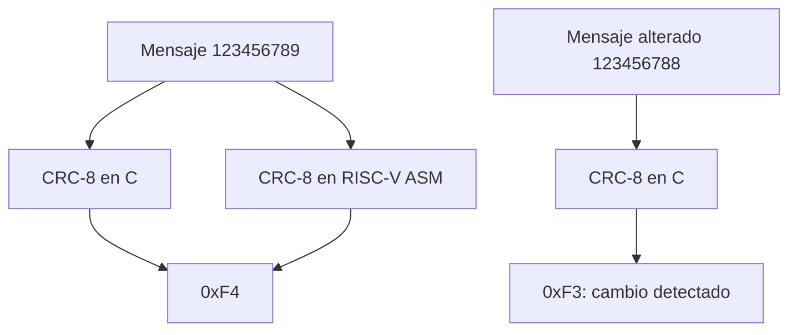
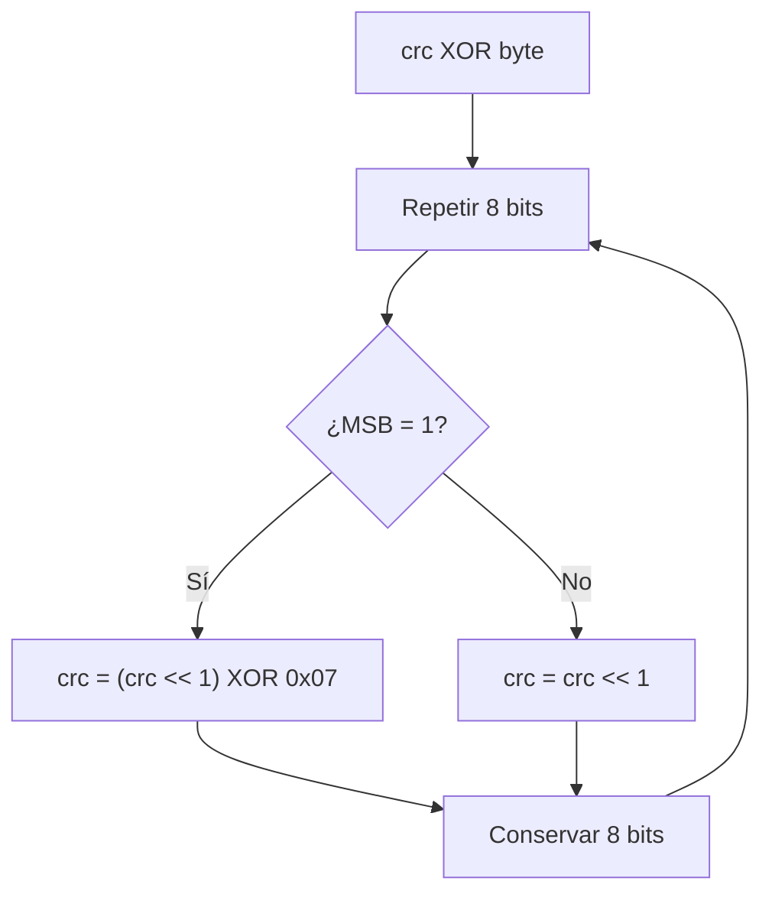

# Exercise 03 - CRC-8 en C y ensamblador RISC-V

**Curso:** Estructuras Computacionales  
**Autora:** Laura Daniela Barragán Silva  
**Plataforma:** GD32VW553HMQ6/HMQ7  
**Arquitectura:** Nuclei RISC-V RV32  
**Entorno:** Visual Studio Code, CMake, Ninja, Nuclei RISC-V GCC y OpenOCD

## 1. Propósito

Este ejercicio estudia la detección de errores mediante redundancia cíclica.
El mismo CRC-8 se implementa en C y en ensamblador RISC-V para comparar:

- operaciones XOR, desplazamiento y máscara;
- recorrido de memoria byte a byte;
- bucles y saltos condicionales;
- paso de parámetros y retorno mediante la ABI RISC-V;
- equivalencia entre una especificación y dos implementaciones;
- detección de una modificación en la información.

No se usa el periférico CRC del microcontrolador: el objetivo es comprender el
algoritmo a nivel de instrucciones.

## 2. Datos y resultados esperados

Se utiliza CRC-8 con polinomio `0x07`, valor inicial `0x00`, sin reflexión y sin
XOR final.

| Trama | CRC esperado |
| --- | --- |
| `123456789` | `0xF4` |
| `123456788` | `0xF3` |

En el depurador deben observarse:

```text
g_crc_c          = 0xF4
g_crc_asm        = 0xF4
g_crc_corrupted  = 0xF3
g_error_detected = 1
g_results_match  = 1
```

## 3. Flujo de información



## 4. Algoritmo por byte



## 5. Salida mediante el LED PC13

Si todas las comprobaciones son correctas, el LED transmite `0xF4` en binario:

```text
0xF4 = 11110100
```

- dos destellos cortos: inicio de trama;
- pulso largo: bit `1`;
- pulso corto: bit `0`;
- transmisión desde el bit más significativo;
- pausa de aproximadamente dos segundos antes de repetir.

La secuencia es:

```text
largo, largo, largo, largo, corto, largo, corto, corto
```

Un parpadeo rápido continuo indica que los resultados no coinciden.

## 6. Estructura

```text
03_CRC8_C_vs_RISCV_Assembly/
├── .vscode/
├── Doc/
│   ├── 1_SETUP.md
│   ├── 2_BUILD_AND_FLASH.md
│   ├── 3_CONCEPTS_AND_QUESTIONS.md
│   ├── 4_DEBUGGING.md
│   └── 5_TROUBLESHOOTING.md
├── Inc/
│   ├── crc8_riscv.h
│   └── gd32vw55x_libopt.h
├── Src/
│   ├── crc8_riscv.S
│   └── main.c
├── cmake/
├── tools/
├── CMakeLists.txt
└── CMakePresets.json
```

## 7. Preparación rápida

1. Copie `tools/local_config.example.ps1` como
   `tools/local_config.ps1`.
2. Configure SDK, toolchain y OpenOCD.
3. Abra esta carpeta como raíz en VS Code.
4. Ejecute `Verify GD32 Environment`.
5. Ejecute `Build + Flash GD32 CRC8`.
6. Cree la configuración de depuración y observe las variables globales.

Las instrucciones completas están en `Doc/`.

## 8. Dependencias externas

El proyecto utiliza `GD32VW55x_Firmware_Library_V1.6.0` desde una ruta local.
No publica SDK, compilador, OpenOCD, rutas personales, `build/`, binarios ni
`launch.json`.
